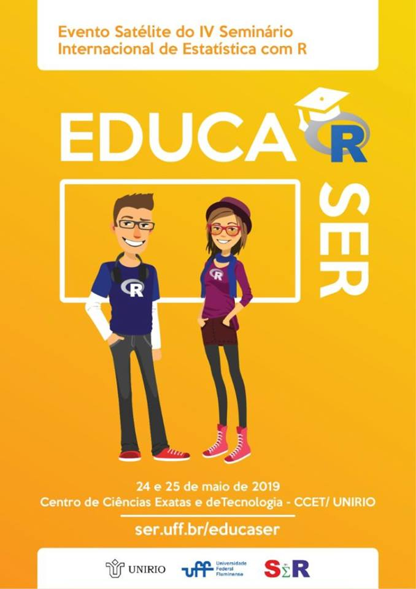
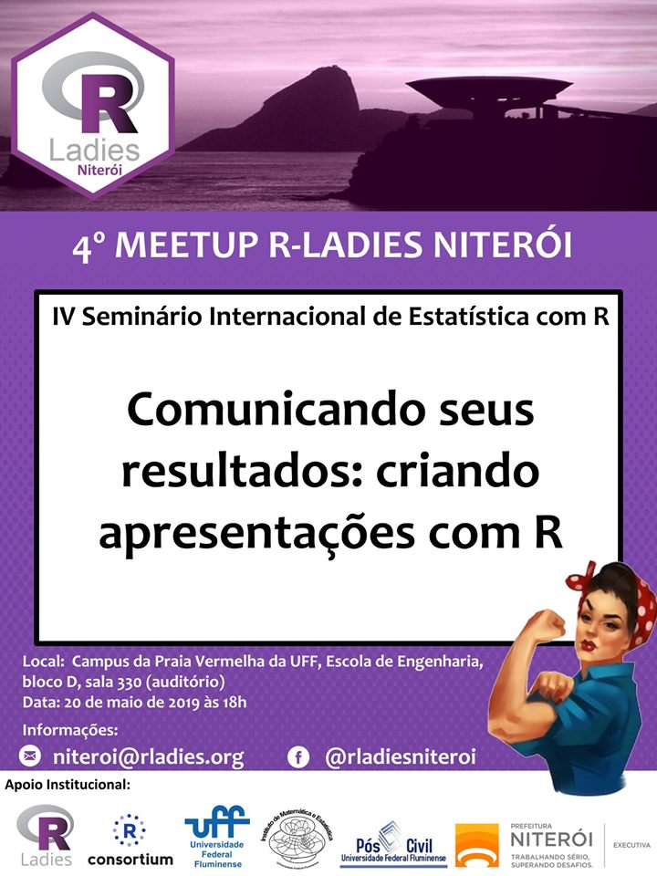

## IV SER PY {data-background-image="ser3.png" data-background-size="130px" data-background-position=top}

### BEM VINDO AO IV SER
>- IV Internacional Seminar on Statistics with R
>- R & Python collaboration trends

## IV SER PY {data-background-image="ser3.png" data-background-size="130px" data-background-position=top}
### PARCEIROS

</img>

## IV SER PY {data-background-image="ser3.png" data-background-size="130px" data-background-position=top}

### MINICURSOS NACIONAIS
>- Integrando R e Python: Usando os pacotes Reticulate e Feather – Bruno/UFF e Leonardo/UFF (nível básico)
>- Integrando o R com C++: Uma breve introdução ao Rcpp – Erick/UFMG e Rumenick/UFMG
>- Análise de Dados Musicais no R – Bruna/R-LADIE e Julio/USP
>- Functional Regression Models – Febrero/USC
>- R + PostgreSQL – Steven e Rafael/UNIRIO

## IV SER PY {data-background-image="ser3.png" data-background-size="130px" data-background-position=top}

### MINICURSOS NACIONAIS (Cont.)
>- Reticulate: Integrando Py e R – Adelmo/UFBA (nível intermediário)
>- Visualização de Séries Temporais com Dygraphs – Karollaynne/ENCE
>- Redução de dimensionalidade: indo além do PCA – Társsio/UFBA
>- Resolvendo Captchas – Julio/USP

## IV SER PY {data-background-image="ser3.png" data-background-size="130px" data-background-position=top}

### MINICURSOS INTERNACIONAIS
>- Datavisualization with highcharts: From beginner to expert – Joshua
>- Building web applications in R using Shiny – Dean Attali

## IV SER PY {data-background-image="ser3.png" data-background-size="130px" data-background-position=top}

### MINICURSOS ONLINE
>- Introdução ao R: https://goo.gl/forms/ztBAk9BRRNJbHWRM2
>- Introdução ao Tidyverse: https://goo.gl/forms/zYDwSnBDgSoceyg02
>- Mais de 500 participantes de todos os estados do Brasil e exterior: Portugal, França e Reino Unido.

## IV SER PY {data-background-image="ser3.png" data-background-size="130px" data-background-position=top}

### 11 PALESTRAS
>- R, Python e Dados abertos no telegram: redes de colaboração por mais controle social
>- Plotly R em 20 minutos
>- Maximizando suas possibilidades com R e Python	
>- Diversidade de Gênero na Ciência de Dados: Formação com Base na Experimentação	
>- VC: Analysing an Aggregate Outcome as Binary Events with R, using Stillbirth Data from the PNAD	
>- Probabilistic Graphical Models in R and Python	

## IV SER PY {data-background-image="ser3.png" data-background-size="130px" data-background-position=top}

### 11 PALESTRAS (Cont.)
>- Time to Shine: Learn how to use R-Shiny and related packages for fun real world use cases
>- Painel Temático: EDUCA-SER 
>- Resolvendo CAPTCHAs com o pacote decryptr	
>- Variable Selection in Regression Models for Complex Data
>- Previsão através de deep learning e redes neurais LSTM: uma combinação insuperável
>- Mission Impossible: Presenting highcharter and its best features in 30 minutes or less	

## IV SER PY {data-background-image="ser3.png" data-background-size="130px" data-background-position=top}

### ARTIGOS E PÔSTERES
>- Sessão Pôster:28 trabalhos 
>- Sessão Oral: 16 trabalhos 
>- Autores envolvidos: 112
>- Instituições envolvidas (30): IFSC, INCO25, AFA, Embrapa Agrobiologia, ENCE, ENSP/PROCC/FIOCRUZ, IFMT, Maynooth University, Ministério da Saúde (MS/SVS/DIAHV), Poupex, PUC-MG, PUC-RJ, R-ladies, SEBRAE, UCDB, UEP, UERJ, UFBA, UFF, UFMG, UFMS, UFRB, UFRJ, UFSC, UFU, UNB, UNICAMP, UNIRIO, USP, UTFP-Câmpus Francisco Beltrão

## EDUCA SER {data-background-image="ser3.png" data-background-size="130px" data-background-position=bottom}

</img>

## R LADIES {data-background-image="ser3.png" data-background-size="130px" data-background-position=bottom}

</img>

## MANTENDO A TRADIÇÃO  {data-background-image="ser3.png" data-background-size="130px" data-background-position=top}
### Sobre o I, II E III SER

## I SER {data-background-image="ser3.png" data-background-size="130px" data-background-position=top}

>- Parcerias Ence/IBGE, IMPA e apoio da CAPES.
>- 3 oficinas: Visualização de Dados, Rcommander e Inteligência Artificial.
>- 11 palestras: relatórios dinâmicos, BETS, Survey, Swirl, Big Data, Estatística Espacial, Planejamento Amostral, Modelos de Confiabilidade, Biologia Computacional, Aprendizado do R, Painéis Shiny.
>- Espaço Blog, Espaço Empresa, Mesa Redonda e Laboratório de Experimentação para iniciantes

## I SER {data-background-image="ser3.png" data-background-size="130px" data-background-position=top}

>- Sessão Pôster: 25 trabalhos envolvendo 59 autores da CEFET, EMBRAPA, ENCE, ESTÁCIO-RN, FGV, IBMEC, MC15 CONSULTORIA, PUC-RJ, UFF, UFPB, UFPR, UFRJ, UNIRIO, UN. DE FLORENÇA.
>- E-book com capítulos dos palestrantes:
   <a title="View Statistics With R: Inovação no Mercado Profissional on Scribd" href="https://www.scribd.com/document/361600824/Statistics-With-R-Inovacao-no-Mercado-Profissional#from_embed"  style="text-decoration: underline;" >Statistics With R: Inovação no Mercado Profissional</a> by <a title="View Luciane Alcoforado's profile on Scribd" href="https://pt.scribd.com/user/136968174/Luciane-Alcoforado#from_embed"  style="text-decoration: underline;" >Luciane Alcoforado</a> on Scribd

>- Anais do SER 2016, ISBN 978-85-98026-63-3:
   <a title="View Anais Ser 2016 on Scribd" href="https://www.scribd.com/document/346151128/Anais-Ser-2016#from_embed"  style="text-decoration: underline;" >Anais Ser 2016</a> by <a title="View Luciane Alcoforado's profile on Scribd" href="https://pt.scribd.com/user/136968174/Luciane-Alcoforado#from_embed"  style="text-decoration: underline;" >Luciane Alcoforado</a> on Scribd

<!--
## Premiação {data-background-image="ser3.png" data-background-size="130px" data-background-position=bottom}

</img>

-->

## II SER {data-background-image="ser3.png" data-background-size="130px" data-background-position=top}

>- Parcerias Ence/IBGE, IMPA, SBMAC e apoio da FAPERJ.
>- 3 oficinas: ggplot2, Programação em R e Inteligência Artificial.
>- 7 minicursos: MLG, Multivariada, Teoria da Resposta ao Item, Dashboards, Séries Temporais, Iniciando com R e Letramento Estatístico

## II SER {data-background-image="ser3.png" data-background-size="130px" data-background-position=top}

>- 6 palestras: Data Science em dados de Criminalidade, Comex Vis, Economia, Banco de Dados SQL e NOSQL, Modelos de Regressão Censurados, Modelos de dados de temperatura máxima.
>- 3 conferências: Modelos de Previsão e Séries Temporais
>- Espaço Blog e Laboratório de Experimentação para iniciantes

## II SER {data-background-image="ser3.png" data-background-size="150px" data-background-position=top}

>- Sessão Pôster: 27 trabalhos envolvendo 85 autores de CEFET, EMBRAPA,  ENCE, FIOCRUZ, INEP, IPEA, PUC-RJ, UERJ, UFBA, UFCG, UFF, UFPA, UFRJ, UFRN, UFRRJ, UFSC, UNIMONTES, UNIRIO. Premiação.
>- Sessão Oral: 21 trabalhos envolvendo 60 autores de BRITISH AMERICAM TOBACCO, CEFET, CHM, CMASM, EMBRAPA, IFNMG, MC15 Consultores, NOVA IMS, PUC-RJ, UERJ, UDESC, UFBA, UFG, UFF, UFPI, UFRGS, UFRJ, UFSC, UNIFACS, UNIMONTES. Premiação.

<!--
## Premiação {data-background-image="ser3.png" data-background-size="130px" data-background-position=bottom}

</img>

-->

## II SER {data-background-image="ser3.png" data-background-size="130px" data-background-position=top}

>- Anais do SER ISSN 2526-7299 e ISBN 978-85-94029-02-7:
   <a title="View Anais Ser2017 Vol2n1  on Scribd" href="https://www.scribd.com/document/360344437/Anais-Ser2017-Vol2n1#from_embed"  style="text-decoration: underline;" >Anais Ser2017 Vol2n1</a> by <a title="View Luciane Alcoforado's profile on Scribd" href="https://pt.scribd.com/user/136968174/Luciane-Alcoforado#from_embed"  style="text-decoration: underline;" >Luciane Alcoforado</a> on Scribd
<iframe class="scribd_iframe_embed" title="Anais Ser2017 Vol2n1 " src="https://www.scribd.com/embeds/360344437/content?start_page=1&view_mode=scroll&access_key=key-OI6UZOxxgbQyQu2urONU&show_recommendations=true" data-auto-height="false" data-aspect-ratio="0.7080062794348508" scrolling="no" id="doc_75999" width="50%" height="30%" frameborder="0"></iframe>
   <a title="View Anais Ser2017 Vol2n2 on Scribd" href="https://www.scribd.com/document/360344687/Anais-Ser2017-Vol2n2#from_embed"  style="text-decoration: underline;" >Anais Ser2017 Vol2n2</a> by <a title="View Luciane Alcoforado's profile on Scribd" href="https://pt.scribd.com/user/136968174/Luciane-Alcoforado#from_embed"  style="text-decoration: underline;" >Luciane Alcoforado</a> on Scribd
<iframe class="scribd_iframe_embed" title="Anais Ser2017 Vol2n2" src="https://www.scribd.com/embeds/360344687/content?start_page=1&view_mode=scroll&access_key=key-DYUus6t9EApYxghy2qzf&show_recommendations=true" data-auto-height="false" data-aspect-ratio="0.7080062794348508" scrolling="no" id="doc_64568" width="50%" height="30%" frameborder="0"></iframe>
>- http://seruff.weebly.com/

<!--
## Data Mining - Prof. Torgo {data-background-image="ser3.png" data-background-size="130px" data-background-position=bottom}

</img>

-->

## III SER {data-background-image="ser3.png" data-background-size="130px" data-background-position=top}

>- Parcerias Ence/IBGE, IMPA, SBMAC, UNIRIO e apoio da CAPES.
>- 8 minicursos: Criação de Pacote, Relatórios dinâmicos, gráficos 2d e 3d, modelos politômicos, jurimetria, Web Scraping, Inferência Bayesiana, Dados financeiros.
>- 8 palestras: mapas, distribuições estáveis, relatórios financeiros, PURRR, mercado de trabalho, aprendizagem do R, Shiny.
>- 5 conferências: Aprendizagem, programação em R, Equações Estruturais, Teoria da resposta ao item, Mineração de textos, R-ladies

## Iniciantes em R {data-background-image="ser3.png" data-background-size="130px" data-background-position=bottom}

>- Minicurso Gratuito (online) de Introdução ao R com mais de 400 participantes
>- https://goo.gl/forms/XWupYzh5dE0mhrFz2

<!--
## Folder {data-background-image="ser3.png" data-background-size="130px" data-background-position=bottom}
>- Marcador de livro com comandos do R
-->

## Sessão Pôster III SER {data-background-image="ser3.png" data-background-size="130px" data-background-position=top}

>- 24 trabalhos envolvendo 69 autores de ENCE, IBGE, IFSC, INEP, PESAGRO, SEAPEC, UDESC, UFBA, UFF, UFG, UFMG, UFSC, UFSCAR, UNIRIO, USP. 

## Sessão Oral III SER {data-background-image="ser3.png" data-background-size="130px" data-background-position=top}

>- 26 trabalhos envolvendo 75 autores de CEFET, FGV, IFF, IFMG, IFMT, MACROPLAN, MPPR, PUC-RJ, UCDB-MS, UEM, UERJ, UFBA, UFF, UFGD, UFMS, UFRJ, UN. SANTIAGO DE COMPOSTELA, UNIRIO, UPE, USP.

## Estatística é com R! {data-background-image="ser3.png" data-background-size="130px" data-background-position=top}

>- www.estatisticacomr.uff.br mais de 180 mil visualizações
>- www.facebook.com/estatisticacomr mais de 1600 curtidas
>- www.youtube.com/estatisticacomr mais de 35 mil visualizações e  quase 800 inscritos
>- R-ladies Niterói com mais de 300 membros
>- Portal, vídeos, tutoriais, livros e treinamento.

## SER PY V {data-background-image="ser3.png" data-background-size="130px" data-background-position=top}
### PROXIMOS PASSOS 
### 2020

<!--
## Programa Estatística é com R! {data-background-image="ser3.png" data-background-size="130px" data-background-position=top}

</img>

## Confraternização {data-background-image="ser3.png" data-background-size="130px" data-background-position=bottom}

</img>

## Confraternização {data-background-image="ser3.png" data-background-size="130px" data-background-position=bottom}

</img>

## Confraternização {data-background-image="ser3.png" data-background-size="130px" data-background-position=bottom}

</img>

## Confraternização {data-background-image="ser3.png" data-background-size="130px" data-background-position=bottom}

</img>

-->
